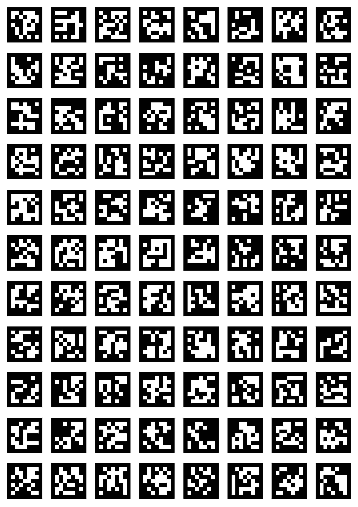

# Fiducial Marker Vision Toolkit

A computer-vision workspace for **camera calibration, fiducial marker detection, and 6-DoF pose estimation** using ArUco, ChArUco, AprilTag, and QR codes.

The repository contains both desktop-camera and Raspberry Pi Camera 2 experiments, with implementations in **Python/OpenCV** and a C++ QR example. It was developed as a practical vision testbed for robotics applications where a camera must detect known visual landmarks and estimate their relative position and orientation.

## Highlights

- ChArUco-based intrinsic camera calibration
- Real-time ArUco detection from USB cameras and Raspberry Pi Camera 2
- Single-marker and GridBoard pose estimation
- AprilTag `tagStandard52h13` detection and pose estimation on Raspberry Pi
- Multi-QR detection experiments in Python and C++
- Real-time coordinate, orientation, and FPS visualization
- Printable marker/board generation utilities and calibration assets

## Engineering Scope

| Area | Implementation |
| --- | --- |
| Camera calibration | ChArUco corner detection, intrinsic matrix, distortion coefficients, reprojection error |
| Fiducial detection | ArUco, AprilTag, QR |
| Pose estimation | `solvePnP`, `estimatePoseSingleMarkers`, coordinate-frame visualization |
| Embedded vision | Raspberry Pi Camera 2 / Picamera2 |
| Performance work | Reduced-resolution processing, FPS monitoring, AprilTag detector tuning |
| Languages | Python, C++ |
| Main libraries | OpenCV, NumPy, Picamera2, AprilTag C library |

## Example Board

<p align="center">
  
</p>

## Repository Structure

```text
aruco/
├── boards/
│   ├── apriltag_board/       # AprilTag sheet generation
│   ├── aruco/                # ArUco / ChArUco board and marker generators
│   └── markers/              # Printable marker assets
├── calibration/
│   ├── calibration.py        # ChArUco camera calibration
│   ├── capture_img.py        # Raspberry Pi calibration-image capture
│   ├── calibration_images/   # Example calibration dataset
│   ├── calibration_matrix.npy
│   └── distortion_coefficients.npy
├── detection/
│   ├── apriltag_detect/      # AprilTag pose estimation
│   ├── aruco/                # ArUco detection and pose estimation
│   └── qr/                   # QR detection experiments
├── all_markers/              # Generated marker sheets/assets
└── README.md
```

## Setup

### Desktop / generic USB camera

```bash
git clone https://github.com/arifcandemirci/aruco.git
cd aruco
python -m venv .venv
source .venv/bin/activate
pip install -r requirements.txt
```

On Windows PowerShell, activate the environment with:

```powershell
.\.venv\Scripts\Activate.ps1
```

### Raspberry Pi Camera 2

Picamera2 and libcamera are normally installed through Raspberry Pi OS packages rather than from PyPI.

```bash
sudo apt update
sudo apt install -y python3-picamera2 python3-libcamera
```

The AprilTag Raspberry Pi experiment additionally requires an AprilTag shared library. The current implementation can use the library distributed with `dt-apriltags`:

```bash
pip install dt-apriltags
```

## Typical Workflow

### 1. Capture calibration images

On a Raspberry Pi:

```bash
python calibration/capture_img.py
```

Capture the ChArUco board from different angles, distances, and image regions. Good geometric coverage is more important than capturing many nearly identical frames.

### 2. Calibrate the camera

```bash
python calibration/calibration.py
```

The calibration script saves:

```text
calibration/calibration_matrix.npy
calibration/distortion_coefficients.npy
```

It also reports the RMS reprojection error so the calibration quality can be evaluated.

> **Important:** the calibration files currently stored in this repository were produced for a specific camera setup. Recalibrate before using pose estimates with another camera, lens, resolution, or focus configuration.

### 3. Run ArUco detection / pose estimation

Generic camera:

```bash
python detection/aruco/detect_aruco_camera.py
python detection/aruco/indv_pose_estimation.py
```

GridBoard pose estimation:

```bash
python detection/aruco/board_pose_estimation.py
```

Raspberry Pi Camera 2:

```bash
python detection/aruco/pose_est_picam2.py
```

### 4. Run AprilTag pose estimation

```bash
python detection/apriltag_detect/april_pose_est_picam2.py
```

The AprilTag implementation directly interfaces with the AprilTag C library through `ctypes` and configures `tagStandard52h13` with a reduced Hamming-error setting to keep memory usage practical on Raspberry Pi hardware.

### 5. QR experiments

Generic camera:

```bash
python detection/qr/multi_qr_cam.py
```

Raspberry Pi Camera 2:

```bash
python detection/qr/multi_qr_picam2.py
```

A C++ multi-QR experiment is also available at:

```text
detection/qr/cpp_multi_qr_picam2.cpp
```

## Configuration Notes

Several scripts intentionally use experiment-specific parameters. Before running a script, verify:

- camera index / camera backend
- image resolution and FPS
- ArUco dictionary
- physical marker or tag size
- GridBoard geometry
- calibration files associated with the active camera

Pose-estimation scale is directly dependent on the configured physical marker/tag dimensions.

## What This Repository Demonstrates

This project focuses on the practical vision pipeline required to turn camera pixels into usable geometric information for robotics:

1. generate or print a known fiducial target,
2. calibrate the camera,
3. detect landmarks in real time,
4. estimate translation and rotation,
5. visualize and validate the result,
6. adapt the pipeline to embedded hardware constraints.

## Current Status

The repository is an actively curated engineering portfolio project. The core experiments are preserved while the project structure, documentation, reproducibility, and code quality are being progressively standardized.
